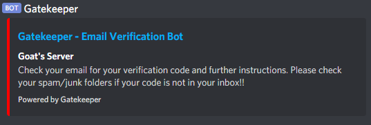
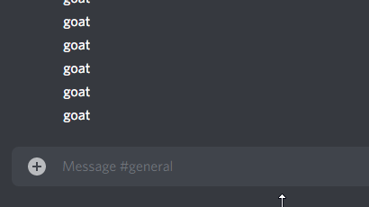

## Gatekeeper - Custom Email Verification in Discord Servers

Gatekeeper is a Discord* bot that allows server administrators to seamlessly integrate custom domain email verification.

**Discord is a communication platform similar to Slack*

### Example Use Case:
- University Discord Server: Give a "Verified Student" role to members of the community that verify their school emails using Gatekeeper.
    - Provides the ability for Discord servers to *verify* student affiliation within their communities.

### Things to Know:
- This bot utilizes [MailGun](https://www.mailgun.com/) to send authentication emails, however it can be easily modified to use [SendGrid](https://www.npmjs.com/package/@sendgrid/mail) as well. 
    - You are free to implement something like [SMTPjs](https://www.smtpjs.com/) if you wish. 
- This bot uses MySQL to store whitelists, authentication codes, and used emails. 

### Setting up Gatekeeper (Server-side)
1. Use `npm i` to install package dependencies.
2. Enter correct API Keys and database credentials in `.env` & line 5 and 6 of `index.js`.
3. Import `db_dump.sql` into your MySQL database.
4. Start server with `node index.js`.

### Setting up Gatekeeper (Client-side)
1. Add the bot to your server.
2. Move the bot to the highesty role in server settings.
3. (As Administrator) execute command: `!gkwhitelist [@domain] [roleID]` anywhere.
    - Example: `!gkwhitelist @columbia.edu 731776430492614667` 

### Available Commands
- !gkhelp - lists all available commands
- !gkemail `[email]` - Sends an email to the given address that includes a verification code.
- !gkverify `[code]` - Verifies if the user inputted code mathches the one generated by system.
- !gkwhitelist `[@domain.com]` `[roleID]` - Sends desired whitelist and roleID to database. (Command available to administrator only)